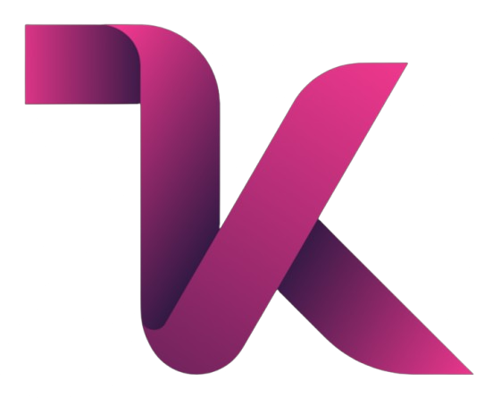

<p align="center">
  
</p>

# Company Profile - React.js


[](LICENSE)

**Modern company profile website for Company Profile: built with React.js and Vite.**

---

## 📋 Project Overview

This is a modern, fully responsive company profile website for Company Profile built with React.js and Vite. The website showcases the company's products, services, outlets, blog articles, and contact information with a clean, professional design optimized for all devices.

---

## ✨ Features & Highlights

- **⚛️ React.js with Modern Hooks**  
  Built with React 18+ using functional components and custom hooks for optimal performance.

- **⚡ Vite Build Tool**  
  Lightning-fast development server and optimized production builds.

- **🎯 Single Page Application (SPA)**  
  Smooth navigation with React Router DOM for seamless user experience.

- **📱 Fully Responsive Design**  
  Mobile-first approach ensuring perfect display on all devices (mobile, tablet, desktop).

- **🧭 Smart Navigation**  
  Auto-hide navbar on scroll (mobile), hamburger menu with overlay, and smooth scrolling.

- **🏠 Multi-Section Website**  
  - **Home**: Hero section with company highlights
  - **About**: Company story and values
  - **Menu**: Product showcase with categories
  - **Blogs**: Article system with modern layouts
  - **Outlets**: Location information and maps
  - **Contact**: Contact form and business information

- **💬 WhatsApp Integration**  
  Floating WhatsApp button for direct customer communication.

- **🌐 Multi-language Support**  
  Language switching functionality with custom hooks.

- **🎨 Modern UI/UX**  
  Clean design with smooth animations and professional styling.

- **⚡ Performance Optimized**  
  Fast loading times with code splitting and asset optimization.

---

## 📁 Project Structure

```
COMPANY PROFILE REACT.JS/
│
├── index.html                  # Main HTML template
├── package.json               # Dependencies and scripts
├── vite.config.js             # Vite configuration
├── LICENSE                    # Project license
├── README.md                  # Project documentation
│
├── docs/                      # Documentation assets
│   └── personal-logo.png      # Personal logo for README
│
├── public/                    # Static assets
│   └── images/               # Image assets
│       ├── about.png
│       ├── blogs1.png
│       ├── desktop1.jpg
│       ├── menu1.png
│       ├── test1.png
│       └── ...
│
└── src/                      # Source code
    ├── App.jsx              # Main App component
    ├── main.jsx             # Application entry point
    │
    ├── assets/              # Internal assets
    │   └── styles/
    │       └── index.css    # Global styles
    │
    ├── components/          # React components
    │   ├── common/          # Shared components
    │   │   ├── WhatsAppFloat.jsx
    │   │   └── WhatsAppFloat.css
    │   │
    │   ├── home/            # Home page components
    │   │   ├── HeroSection.jsx
    │   │   ├── AboutSection.jsx
    │   │   ├── MenuSection.jsx
    │   │   ├── BlogPreviewSection.jsx
    │   │   ├── FreshSection.jsx
    │   │   └── respective .css files
    │   │
    │   └── layout/          # Layout components
    │       ├── Header.jsx
    │       ├── Footer.jsx
    │       ├── Layout.jsx
    │       └── respective .css files
    │
    ├── hooks/               # Custom React hooks
    │   ├── useLanguage.jsx
    │   ├── useNavbarScroll.js
    │   └── useSmoothScroll.js
    │
    ├── pages/               # Page components
    │   ├── Home.jsx
    │   ├── About.jsx
    │   ├── Menu.jsx
    │   ├── Blogs.jsx
    │   ├── Outlets.jsx
    │   ├── Contact.jsx
    │   └── respective .css files
    │
    └── utils/               # Utility functions
```

---

## 🚀 Getting Started

### Prerequisites

- Node.js (version 16 or higher)
- npm or yarn package manager

### Installation

1. **Clone the repository**
   ```bash
   git clone [repository-url]
   cd "COMPANY PROFILE REACT.JS"
   ```

2. **Install dependencies**
   ```bash
   npm install
   ```

3. **Start development server**
   ```bash
   npm run dev
   ```
   The application will open automatically at `http://localhost:3000`

### Available Scripts

- `npm run dev` - Start development server with hot reload
- `npm run build` - Build production-ready application
- `npm run preview` - Preview production build locally
- `npm run lint` - Run ESLint for code quality checks

---

## 🛠️ Built With

- **[React.js](https://reactjs.org/)** - Frontend library for building user interfaces
- **[Vite](https://vitejs.dev/)** - Fast build tool and development server
- **[React Router DOM](https://reactrouter.com/)** - Declarative routing for React
- **[React Helmet Async](https://github.com/staylor/react-helmet-async)** - Document head management
- **Vanilla CSS** - Custom styling without external CSS frameworks

---

## 📱 Key Features Implementation

### Custom Hooks
- **`useLanguage`** - Multi-language support management
- **`useNavbarScroll`** - Smart navbar behavior on scroll
- **`useSmoothScroll`** - Smooth scrolling functionality

### Responsive Design
- Mobile-first CSS approach
- Flexible grid layouts
- Optimized images and assets
- Touch-friendly navigation

### Performance Optimizations
- Component lazy loading
- Image optimization
- Code splitting with Vite
- Minimal bundle size

---

## 🚀 Deployment

### Build for Production
```bash
npm run build
```

The `dist/` folder will contain the production-ready files that can be deployed to any static hosting service like:
- Vercel
- Netlify
- GitHub Pages
- AWS S3
- Firebase Hosting

---

## 🤝 Contributing

1. Fork the repository
2. Create your feature branch (`git checkout -b feature/AmazingFeature`)
3. Commit your changes (`git commit -m 'Add some AmazingFeature'`)
4. Push to the branch (`git push origin feature/AmazingFeature`)
5. Open a Pull Request

---

## 👤 Author

- Kelvianov Putra Kesuma - Initial work

---

## 📄 License

This project is licensed under the MIT License - see the [LICENSE](LICENSE) file for details.

---

## 📞 Support

If you have any questions or need support, please contact:
- Email: [kelvianov10@gmail.com]
- WhatsApp: [082295029308]

---

**Built with ❤️  | React.js + Vite | Last Updated: July 2025**
